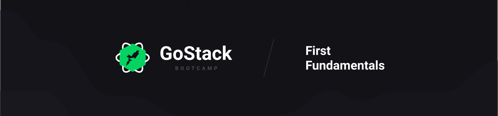

<p align="center">
  
  
  
</p>

## **:book: Summary**

- [About this project](#-about-the-project)
- [Principle libraries](#-principle-libraries)
- [Prerequisites](#warning-prerequisites)

## ** About the project**

This is the first project created in @Rocketseat GoStack Bootcamp, where we create a mobile and web application to consume a mocked Node.js backend.

## **:warning: Prerequisites**

- <a href="https://nodejs.org/en/" target="_blank">NodeJS</a>
- <a href="https://yarnpkg.com/" target="_blank">YarnPKG</a> or <a href="https://www.npmjs.com/" target="_blank">NPM</a>
- <a href="https://react-native.rocketseat.dev/android/windows" target="_blank">Android</a> or <a href="https://react-native.rocketseat.dev/ios/macos" target="_blank">iOS</a> environment

### Running the server

```bash
  # Clonning the repository
  git clone https://github.com/dgbragas/gostack__github-explorer

  # Entering in the cloned folder
  cd gostack__github-explorer/backend

  # Installing project dependencies (you can also use 'npm install')
  yarn

  # Running the application (it will run at http://localhost:3000)
  yarn dev
```

### Running the web application

```bash
  # Clonning the repository
  git clone https://github.com/dgbragas/gostack__github-explorer

  # Entering in the cloned folder
  cd gostack__github-explorer/frontend

  # Installing project dependencies (you can also use 'npm install')
  yarn

  # Running the application (it will run at http://localhost:3000)
  yarn start
```

### Running the mobile application

```bash
  # Clonning the repository
  git clone https://github.com/dgbragas/gostack__github-explorer

  # Entering in the cloned folder
  cd gostack__github-explorer/backend

  # Installing project dependencies (you can also use 'npm install')
  yarn

  # After initialize your AVD, insert this command:
  yarn react-native run-android

  # Then maybe you will need start the app again. For this you can type
  yarn start
```

---

_Develop by @dgbragas at @Rocketseat GoStack Bootcamp_
