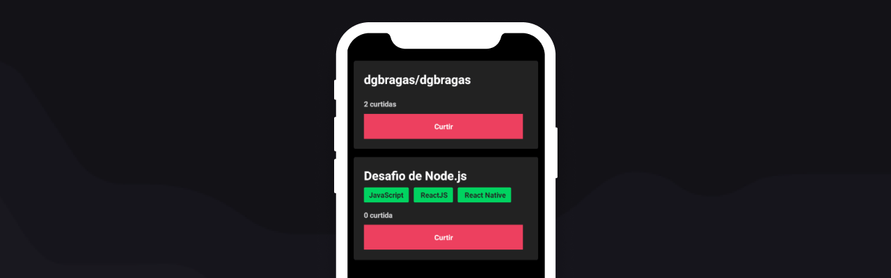

# **First Fundamentals: Mobile**

## **:heavy_plus_sign: Default scope**

- The user should be able to like an existent repositorie
- After load GET all existent repositories

## **:fire: Principle libraries**

- **axios:**: v0.19.2
- **axios-mock-adapter:**: v1.18.1

---

*Developed by @dgbragas at @Rocketseat GoStack Bootcamp*
